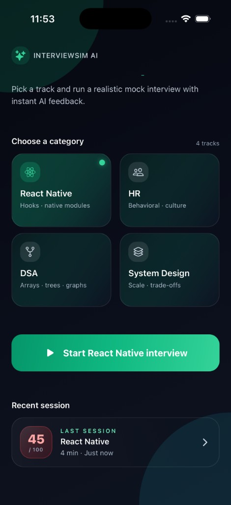
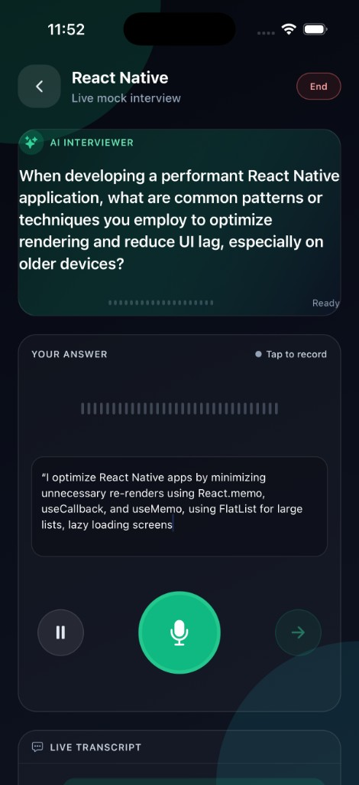
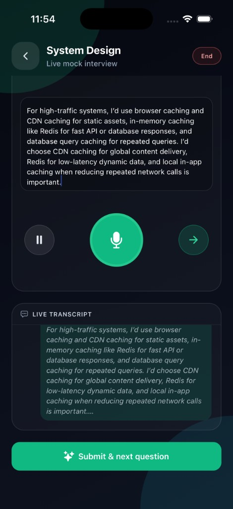
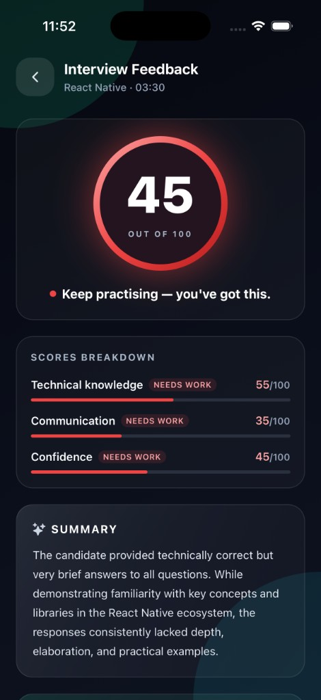
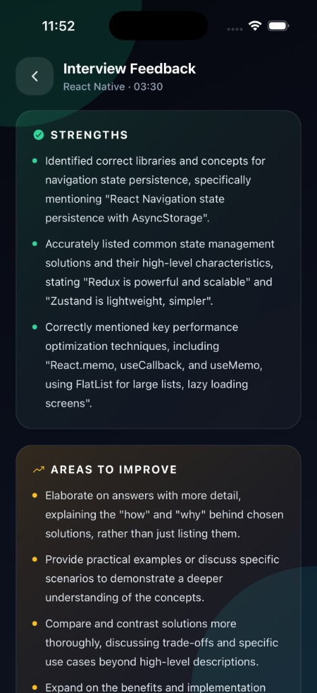

# InterviewSimAI

> Train smarter. Interview sharper.

A React Native + Expo mobile app that runs **realistic AI-driven mock interviews** end to end. Pick a track, get questions generated by Gemini, record spoken answers (transcribed by Gemini), and finish with a scored AI feedback report — all on device, with sessions persisted locally.

---

## Screenshots

<table>
  <tr>
    <td align="center"><b>Home</b></td>
    <td align="center"><b>Live Interview</b></td>
    <td align="center"><b>Recording &amp; Transcript</b></td>
  </tr>
  <tr>
    <td></td>
    <td></td>
    <td></td>
  </tr>
  <tr>
    <td align="center"><b>Score &amp; Subscores</b></td>
    <td align="center"><b>Strengths &amp; Improvements</b></td>
    <td></td>
  </tr>
  <tr>
    <td></td>
    <td></td>
    <td></td>
  </tr>
</table>

---

## Features

- **4 interview tracks** — React Native, HR / Behavioral, DSA, System Design.
- **AI-generated questions** — Gemini produces fresh, schema-validated questions per session, with a built-in fallback to a curated sample set if the API is unreachable.
- **Voice answers + AI transcription** — Tap to record, Gemini transcribes the audio, and you can still edit the text before submitting.
- **Live session timer** with pause / resume.
- **Holistic AI feedback** — overall score (0–100) plus subscores for technical knowledge, communication, and confidence, a written summary, 3–5 strengths and 3–5 concrete improvements.
- **Local session history** — every completed interview is saved to AsyncStorage so you can revisit past feedback.
- **Polished dark UI** with NativeWind, gradient backgrounds, animated transitions, and a score ring that adapts its color to performance.
- **Cancellable AI requests** — leaving a screen or retrying aborts in-flight Gemini calls cleanly.
- **Resilient networking** — automatic retries with exponential backoff on 429 / 5xx responses.

---

## Tech Stack

| Layer            | Choice                                                                 |
| ---------------- | ---------------------------------------------------------------------- |
| Runtime          | [Expo SDK 56](https://docs.expo.dev/versions/v56.0.0/), React Native 0.85, React 19 |
| Language         | TypeScript (strict mode, `@/*` path alias)                             |
| Styling          | [NativeWind v4](https://www.nativewind.dev/) (Tailwind CSS for RN)     |
| Navigation       | `@react-navigation/native-stack` v7                                    |
| State            | [Zustand](https://zustand-demo.pmnd.rs/) + `persist` middleware        |
| Storage          | `@react-native-async-storage/async-storage`                            |
| Audio            | `expo-audio` (new SDK 56 API)                                          |
| File I/O         | `expo-file-system` (new `File` API)                                    |
| AI               | Google Gemini (`gemini-2.5-flash` by default) via `axios`              |
| Animations       | `react-native-reanimated` v4                                           |
| Icons            | `@expo/vector-icons` (Ionicons)                                        |

---

## Getting Started

### Prerequisites

- Node.js 20+
- npm (or your preferred package manager)
- [Expo Go](https://expo.dev/client) on a physical device, **or** Xcode (iOS Simulator) / Android Studio (Emulator)
- A Google Gemini API key from [Google AI Studio](https://aistudio.google.com/app/apikey)

> **Note:** Audio recording does not work on the iOS Simulator. Use a real device or an Android emulator with a working mic for the recording flow.

### 1. Install

```bash
git clone <repo-url>
cd InterviewSimAI
npm install
```

### 2. Configure environment

Create a `.env` file in the project root (use `.env.example` as a template):

```bash
EXPO_PUBLIC_GEMINI_API_KEY=your-gemini-api-key
EXPO_PUBLIC_GEMINI_MODEL=gemini-2.5-flash
```

`EXPO_PUBLIC_*` variables are inlined into the JS bundle at build time, so **restart Expo after changing `.env`**.

### 3. Run

```bash
npm start          # Expo dev server (pick a target from the menu)
npm run ios        # iOS Simulator
npm run android    # Android Emulator
npm run web        # Web build
```

---

## How It Works

```text
Home ──▶ Interview ──▶ Feedback
 │           │             │
 │           ├─ Gemini: generateInterviewQuestions
 │           ├─ expo-audio: record answer
 │           ├─ Gemini: transcribeAudioRecording
 │           └─ Gemini: evaluateSession (on finish)
 │
 └─ Recent session from local history
```

1. **Home** — choose a category and tap *Start*.
2. **Interview** — on mount, the app requests 3 fresh questions from Gemini. The "AI interviewer" speaks the question, then you tap the mic, record your answer, and Gemini transcribes it. You can edit the transcript before submitting.
3. **Feedback** — after the last question, the full Q&A is sent to Gemini for a holistic evaluation. The session is saved to local history and you land on the feedback screen.

---

## Project Structure

```text
.
├── App.tsx                    # Root: providers + navigator + history hydration
├── index.ts                   # registerRootComponent(App)
├── app.json                   # Expo config (incl. expo-audio mic permission)
├── babel.config.js            # babel-preset-expo + nativewind/babel
├── metro.config.js            # withNativeWind(...)
├── tailwind.config.js         # Design tokens (brand / accent / ink palettes)
├── global.css                 # Tailwind directives
├── .env.example               # Required env vars
├── assets/                    # App icons, splash, favicon
├── docs/screenshots/          # README screenshots
└── src/
    ├── components/            # 13 reusable UI components (cards, buttons, waveform, …)
    ├── constants/             # theme, layout helpers, mockQuestions fallback
    ├── hooks/
    │   └── useAudioRecorder.ts  # expo-audio wrapper (permissions, mode, lifecycle)
    ├── navigation/
    │   └── AppNavigator.tsx     # Native stack: Home → Interview → Feedback
    ├── screens/
    │   ├── HomeScreen.tsx
    │   ├── InterviewScreen.tsx
    │   └── FeedbackScreen.tsx
    ├── services/
    │   ├── aiService.ts         # Gemini client (questions, transcription, feedback)
    │   ├── historyService.ts    # Persisted session history
    │   └── storage.ts           # Typed AsyncStorage wrapper
    ├── store/
    │   └── interviewStore.ts    # Zustand store + selectors
    ├── types/                   # Domain + navigation types
    └── utils/
        └── score.ts             # Score tone → color/label maps
```

---

## Gemini Integration (`src/services/aiService.ts`)

The AI service is a single, dependency-light module that:

- Reads `EXPO_PUBLIC_GEMINI_API_KEY` / `EXPO_PUBLIC_GEMINI_MODEL` and throws a descriptive `GeminiServiceError` if the key is missing.
- Uses Gemini's **JSON response schemas** (`responseMimeType: 'application/json'` + `responseSchema`) so questions and feedback come back as strict, typed JSON — no fragile regex parsing.
- Sends audio inline via `inlineData` (base64), capped at 14 MB to stay within the inline-data limit.
- Retries on `429 / 500 / 502 / 503 / 504` with exponential backoff (up to 3 retries).
- Supports `AbortSignal` for cancel-on-unmount and retry semantics.

Exposed helpers:

| Function                       | Purpose                                              |
| ------------------------------ | ---------------------------------------------------- |
| `generateInterviewQuestions`   | Topic + difficulty → array of questions              |
| `transcribeAudioRecording`     | Audio file URI → plain-text transcript               |
| `evaluateAnswer`               | Single Q/A → scored feedback                         |
| `evaluateSession`              | Full Q/A list → overall + subscored feedback         |
| `isGeminiConfigured`           | Quick env-var check                                  |

---

## State Management

A single Zustand store (`src/store/interviewStore.ts`) owns:

- **Selection**: `selectedCategoryId`, `selectedDifficulty`
- **Live session**: `currentSessionId`, `currentQuestions`, `currentQuestionIndex`, `currentAnswers`, `transcript`
- **History**: `history`, `historyHydrated` (mirrored to `historyService`)
- **Loading flags**: `questions | transcription | feedback`
- **Timer**: `{ isRunning, elapsedMs, startedAt }` with `start / pause / tick / reset`

Only the small selection slice is persisted by the store middleware (`partialize`). The heavier `history` blob is owned by `historyService`, which serializes through a typed, namespaced AsyncStorage wrapper (`@interviewsim:interview-history/v1`).

Exported selectors: `selectCurrentQuestion`, `selectProgress`, `selectElapsedMs`, `selectAverageScore`, plus a `formatElapsed(ms)` helper.

---

## Available Scripts

```bash
npm start        # expo start
npm run ios      # expo start --ios
npm run android  # expo start --android
npm run web      # expo start --web
```

---

## Troubleshooting

- **"Missing EXPO_PUBLIC_GEMINI_API_KEY"** — Add the key to `.env` and **restart `expo start`** (Metro caches env vars).
- **No questions appear / "Couldn't load AI questions"** — Tap *Use sample set* in the error banner to fall back to bundled questions, or check your API key / quota.
- **"Recording is not supported on the iOS Simulator"** — Use a real device or an Android emulator.
- **"Recording is too large to transcribe inline"** — Keep individual answers under ~14 MB of audio; the app prompts you to record a shorter answer.
- **History feels stale** — The store hydrates history once on app start (`App.tsx`). Fully reload the app or clear history from within the store to reset.

---

## Security Notes

`EXPO_PUBLIC_*` env vars are **bundled into the client app**. This is fine for local development and personal use, but if you ship this anywhere public you should:

- Proxy Gemini calls through a backend you control.
- Rotate the key in [Google AI Studio](https://aistudio.google.com/app/apikey) if it ever leaks.
- Restrict the key (HTTP referrers / API restrictions) wherever possible.

---

## License

This project is provided as-is for learning and personal use. Add a license of your choice before distributing.
